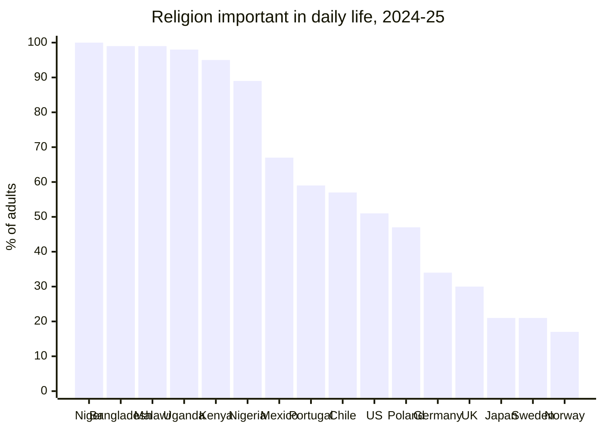
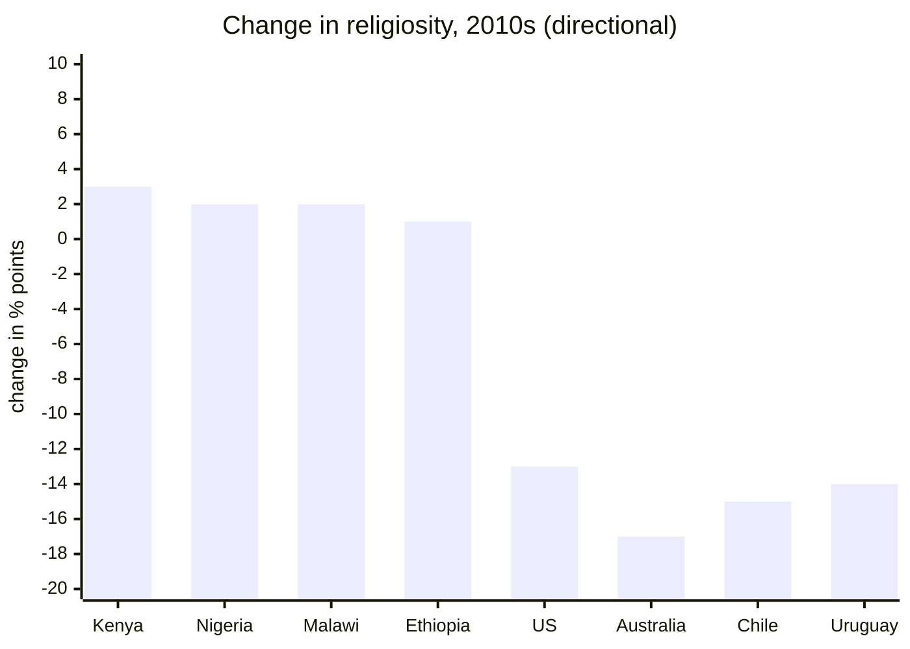
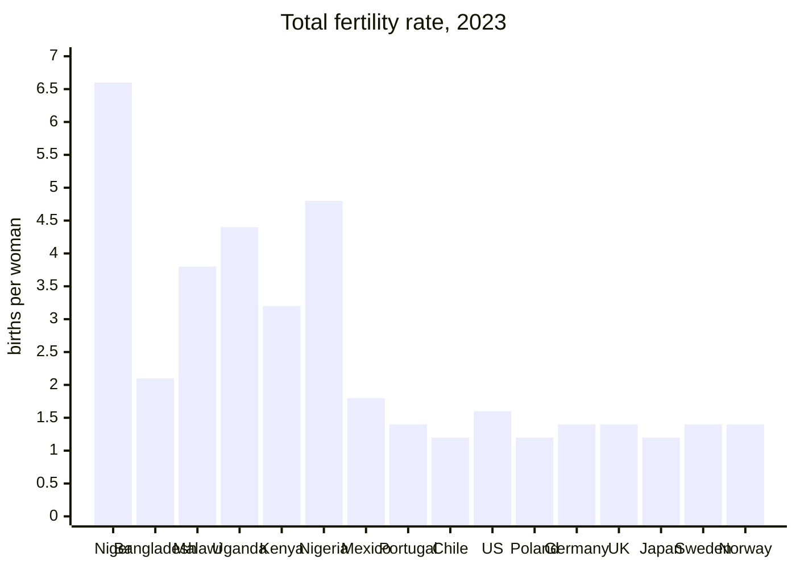

## Background

I am a very statistical person. I have always loved numbers since I was a kid. Every school project, many personal projects, and many observations I have resolve around numbers, statistics, and patterns. I was also raised in a household that had several very successful businesses but was also a very religious house. These three things combined created a couple unique interests of mine.

### Interest 1: Religious Statistics

I loved reading about religion. Any type, any beliefs, any culture, any location. Seeing the fall of Christianity in Europe and Americas while seeing the rise of it and Islam in Africa. Seeing countries that always integrated religion into government slowly phase it out and become "woke." These things interested me.

### Interest 2: Economic Statistics

Taking religion out of the picture, I was still interested in finances, numbers, and world economics. I think this one is a little less unique. Nonetheless, I was still interested in researching things like Chinas development on capitalistic zones, seeing how the US govt debt is actually used in a beneficial extent. Seeing how money flows in startups and through VC and investment firms, and more recently researching liquidity problems in the stock market. 

## Observations

One of the observations I noticed first in my life was the decline or stagnation of religion in first world countries and the continued high success of religion in povershed countries.

```mermaid
%% caption: We see most first world countries experience a slight movement but are already considerably low compared to their poorer counterparts.
xychart-beta
    title "Religion important in daily life: 2009 vs 2024-25"
    x-axis [Bangladesh, Niger, Senegal, Malawi, US, UK, France, Japan, Sweden]
    y-axis "% of adults" 0 --> 100
    bar [99, 100, 99, 99, 65, 27, 30, 24, 17]
    bar [99, 100, 99, 99, 49, 30, 25, 21, 21]
```

The second observation came a lot later and I think it is related. Birth rates do the same thing.

This is the same list of countries in the same order as the first chart. I did not reorder anything. Niger is the highest on both. Japan is the lowest on both. Once you get to Mexico it flattens out into the same band between one and two kids, which is right around where the religion numbers flatten out too.

It is not perfect. Bangladesh is very religious and is already down to about two children per woman, so the two things can clearly come apart. Nigeria goes the other way. But two out of sixteen does not really change the shape of it.

Correlation is not causation and I am not going to act like it is. Being religious does not make you have kids and having kids does not make you religious. What I think is worth asking is why two totally different behaviors drop off at about the same income level, in the same decade, in close to the same order.

## The Connection

I think the connection is that both of them used to be useful.

Religion cost you time and money and a list of things you were not allowed to do. What you got back was a community that showed up when you were sick, a reason to keep going when things were bad, and a set of rules you did not have to figure out yourself. For most of history that was worth it.

Children cost more. What you got back was labor and old age insurance. Somebody to take care of you at sixty, and enough of them that it still worked out if one or two did not make it. That was worth it too.

Neither one of those is worth it in a first world country anymore, at least not in the same way. I do not think that is people getting worse or losing their morals. I think it is people responding to their situation, which is what people always do.

## Why This Happens

Take everything religion and children used to provide and look at what a first world country provides instead.

If you get sick you go to a hospital. If you lose your job there is unemployment and there is savings. If you get old there is social security and a 401k, and you do not need a son for any of it. If you are lonely there is a phone with more people in it than any church ever had. If you need rules there is a legal system. If you need something to organize your life around there is a career.

All of it is covered now. Usually worse and usually more expensively, but covered well enough that you never really hit the point where you would go looking for something else.

This is where the title comes from. Nobody prays in a warm house. I do not mean people in warm houses are smarter or that they figured something out. Praying is what you do when the house is cold and you are out of options. Take away the cold and the praying goes with it. Kids are the same. Nobody in Niger loves their kids more than somebody in Norway does. They are dealing with a problem that Norway already solved a different way.

## The Dilemma

The part I keep coming back to is that the things a country drops on the way to being comfortable are the same things that got it comfortable.

You do not get to be a first world country without a lot of people having a lot of kids, and without enough shared belief in something to build things that outlast the people building them. Then the country succeeds, and a generation or two later the population looks at both of those and decides, correctly, that it does not need them anymore.

The bill for that shows up later and it shows up as arithmetic.

```mermaid
%% caption: How many working age adults there are for every person over 65. The 2050 numbers are projections but they are mostly already set.
xychart-beta
    title "Workers per retiree, 2025 vs 2050 (projected)"
    x-axis [US, UK, Germany, Italy, Japan, "South Korea"]
    y-axis "adults 20-64 per person 65+" 0 --> 4
    bar [3.1, 2.9, 2.6, 2.2, 1.8, 3.2]
    bar [2.3, 2.2, 1.8, 1.4, 1.3, 1.1]
```

South Korea is the one I would look at. It has the best ratio on that chart right now and the worst one twenty five years from now. That is not a prediction about how people are going to behave. Everybody who will be working in 2050 has already been born, so the top number is set. The pension system, the healthcare system, and most of the tax base of every country on that chart are running on a number nobody can change at this point.

## Trying To Fix It

The obvious answer is that the government should pay people to have kids, and a lot of countries have tried this.

South Korea has spent somewhere over $200 billion on it since 2006. In that same window its fertility rate went from about 1.1 to about 0.7, which is the lowest number ever recorded anywhere. Hungary spends around five percent of GDP on family policy, which is more than it spends on its military, and it got a bump from about 1.2 to about 1.5 before it started sliding back. France has the most generous family policy in Europe and is still under replacement.

So the money does not seem to be the issue. I think you cannot pay somebody back into a behavior that only existed because it was necessary. Needing the subsidy is itself evidence that the necessity is gone.

Religion is the same. Countries have tried putting it back in the schools and back in the constitution and it does not move the numbers much, because what filled the churches was never a law.

## What I Think

I am not writing this to say anybody should go back to church or have six kids. I do not think you can talk somebody into either one, and most of this post is my explanation for why.

What I think is that comfort has a cost and the cost is not money. The cost is that the behaviors that built the comfort stop making sense to the people who grow up inside of it. Every generation in the warm house is a little more confused about why anybody bothered building it, and a little worse at building another one.

I do not have a solution and I am pretty suspicious of anyone who says they do, especially since the countries trying the hardest have the worst numbers. What I have is the pattern, and the pattern is very consistent. Income goes up, religion goes down, births go down, and the difference gets covered with immigration and debt for however long that works.

I should also say that I am part of this, which is probably worth admitting after spending five charts pointing at other people.

I still follow religion. I was raised in it and I kept it and I do not really see that changing. But I am not planning on having kids. I have thought about it a decent amount and the honest answer is that none of the old reasons apply to me. I am not going to need them for work, I am not going to need them to take care of me when I am older, and everything else I would want out of it I can get some other way. That is the exact argument I just spent this whole post making. Knowing the argument does not seem to make me any less of an example of it.

So I am sitting somewhere in the middle of my own chart. I kept the cheap one and dropped the expensive one, which is more or less what Bangladesh is doing, just for completely different reasons. I think that is probably where a lot of people end up. Religion is a lot easier to hold onto than kids are because it does not ask for the same thing.

I am not sure if any of this is a problem or if it is just what happens. Probably some of both. But it is the most consistent thing I have found in all the years I have been looking at this stuff, and I have not seen anybody give a good answer for it, including me.
